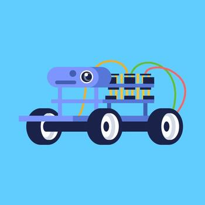
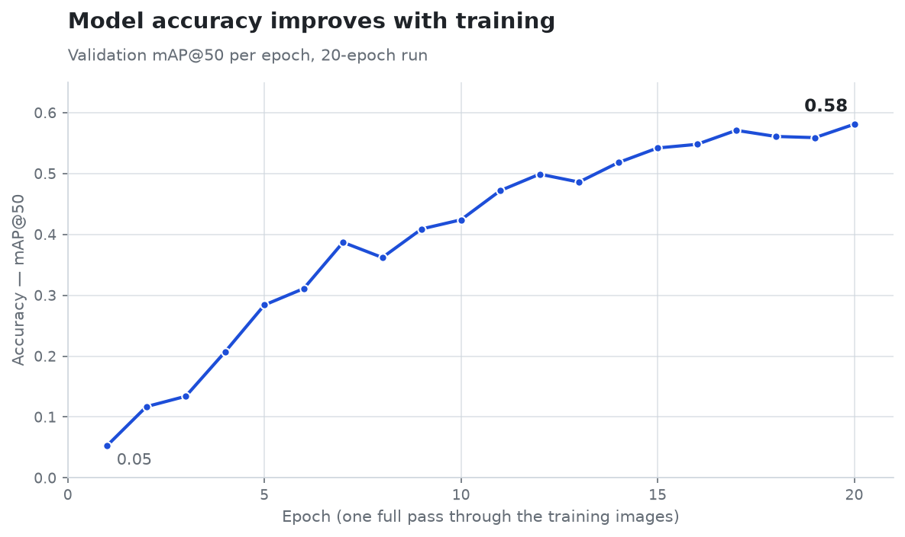

# Tokyo Robotics Robot Car - Camera + AI Image Detection

My work on the camera and AI mineral detection for the Final Project (Mining Robot for CIEE Tokyo Engineering and Robotics Summer Session Two 2026)




## Introduction

Learned about AI via Inspirit AI online course prior to program, so I decided to integrate some of the stuff I learned about AI models and how they for example can be trained to detect images. I thus decided to train an AI model to recognize certain minerals as I thought it was practical in the context of a robot that is supposed to scout out unsafe mines to evaluate the contents within them and their safety in general.


## Overview

I used Ultralytics (essentially a sort of toolkit that allows users to train image recognition models simply), specifically their YOLO11n base model, coming from the YOLO family of AI models, the "n" at the end of the name is the "nano" version, the only one able to run on a raspberry pi. I retrieved datasets from Roboflow Universe to train the base layer of the AI recognition model (by "base layer" I mean that it is able to recognize simple emenets of images, such as curves, shapes, textures, etc.) via Colab (see colab_train.ipynb).

After training and testing, the average precision came out to be around 0.75 (on a 0-1 scale), with indication that, with more training, the precision could continue to increase. This last assumption is based off the fact that, after every epoch (one cycle through all the training photos), the accuracy was steadily increasing and showed no signs of levelling off (0.58 after 20 epochs vs 0.75 after 100 epochs). The training for epochs 0 - 20 is visible in the graph below; the per-epoch accuracy for the full 100-epoch run wasn't saved from Colab, so only the first 20 epochs are shown.



## Setup and Requirements

Libraries (Installable via pip):
* Ultralytics (YOLO model)
* PyTorch (Engine; processes model weights + pixel data)
* Picamera2 (To read the camera)
* OpenCV + NumPy (Image data)

### Running the Program


On the pi, run app.py while pointing the camera at a mineral, and as the camera captures frames
each frame gets run through the model and whatever the model detects is printed out. The program
runs until it is stopped by pressing Ctrl-C on the keyboard.

## File Tree with Explaination 


```text
image_recognition/
├── app.py              # Main program — reads camera, runs detection, prints results
├── train.py            # Trains the YOLO model on a labeled dataset
├── colab_train.ipynb   # Trains the model on Google Colab (free GPU)
├── camera_test.py      # Quick check that the Pi camera captures frames
├── stream_camera.py    # Live camera feed viewable in a web browser (Eventually went unused)
├── collect_images.py   # Collects training images from the Pi camera (Went unused)
├── download_images.py  # Downloads training images from web search (Went unused in the end)
└── models/
    └── ore_best.pt     # Trained mineral-detection model (15 classes)
```


## Credits & Sources

- **Training dataset** — [*mineral +++* by mineraldetectionyolo](https://universe.roboflow.com/mineraldetectionyolo/mineral-c42yg),
  from Roboflow Universe. Licensed under **CC BY 4.0** (used with attribution).
- **Model framework** — [Ultralytics YOLO](https://github.com/ultralytics/ultralytics)
  (the YOLO11n base model, built on PyTorch).
- **Live camera streaming** — `stream_camera.py` is adapted from the official
  [picamera2 MJPEG streaming example](https://github.com/raspberrypi/picamera2/blob/main/examples/mjpeg_server.py).
- **Background knowledge** — foundational AI concepts learned through the
  [Inspirit AI](https://www.inspiritai.com/) course prior to the program.

### Use of AI (Claude)

Anthropic's **Claude** was used as a coding and learning assistant during this
project — for scaffolding and debugging code, explaining machine-learning
concepts (how YOLO models, epochs, and mAP work), and troubleshooting the
Raspberry Pi setup (SSH, the camera, and dependencies).

It was used **responsibly**, as a tool to understand and speed up the work rather
than to replace it. I made the design decisions, trained and tested the model
myself, verified the AI's suggestions before using them, and made sure I
understood every part of the code that ended up in the project.

Any inquiries about my understanding attained from this project from David I would
be happy to answer via my email associated with my CIEE canvas account.
